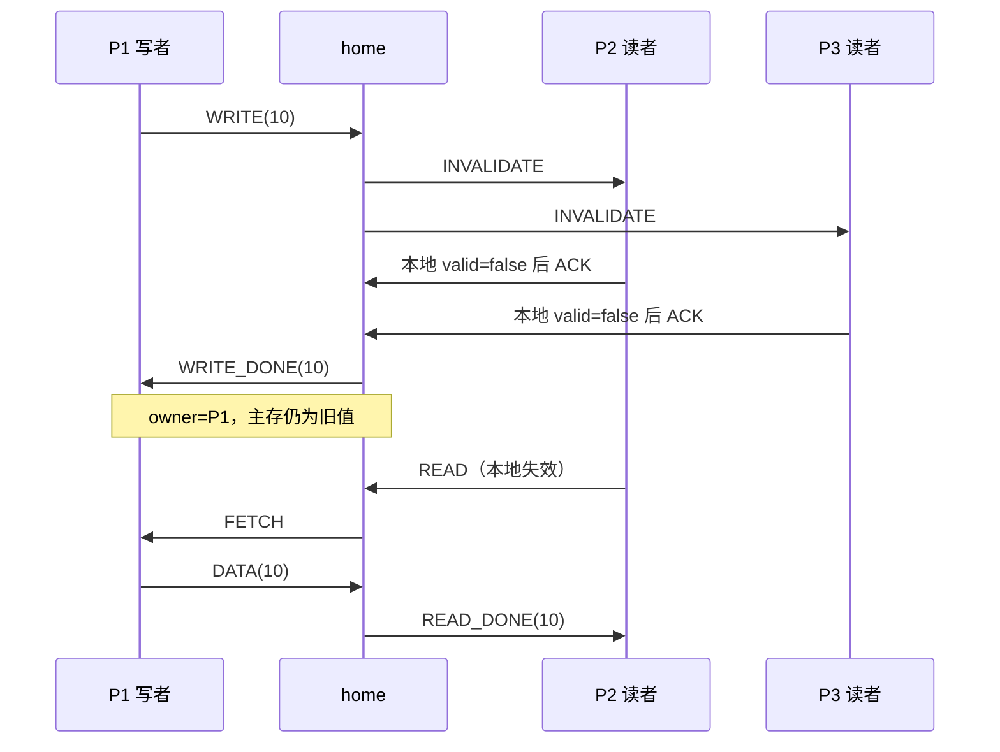

# C++：通过消息维护 WB 缓存一致性

[教学路线](../../../notes/programming/ch01-teaching-guide.md) · [源代码](demo.cpp)

三个缓存节点各有一个线程，home 节点在主线程中运行。缓存值是各线程的局部变量；共享的只有模拟网络的信箱和打印锁。节点不能直接读取另一个节点的缓存，也不能直接读取 home 的主存。

这是单机上的多节点消息模拟；它没有创建远程进程，也没有使用真实网络。一个共享地址的冲突请求由 home 排序，而不同节点的工作、发送和等待可以重叠。这正是要区分的两件事：执行者可以并发，冲突访问仍需要协议确定先后。

## 手动实现的组件

| 组件 | 数据与操作 |
| --- | --- |
| 本地缓存 | `valid / dirty / value`，只由所属节点读写 |
| 网络信箱 | 固定数组，手动移动 head/tail，维护 count；满则等待，空则等待 |
| 延迟 | 每次发送者 sleep 5 ms 后入队；模拟应用也会独立 sleep |
| home 目录 | `sharers` 记录有效副本持有者，`owner` 记录脏数据负责人 |
| 待处理队列 | home 等回复时暂存新请求，收到所需 ACK/DATA 后继续 |
| 关闭流程 | 应用 DONE 后缓存节点继续服务；最终写回完成后才 STOP、join |

互斥量和条件变量只保护消息交付及日志。它们并没有自动实现目录协议；决定谁供数、何时失效、何时允许写入的逻辑都写在 `run_home` 与 `service` 中。

## 一次写入为什么要等待确认

假设 P1、P2、P3 已缓存旧值，P1 要写 10：



这是解释协议的条件性时序图，不是本次执行轨迹。实际中 P2 也会请求写入 20，请求到达顺序可能变化。

写者必须等待旧副本失效完成。若其他节点还没处理失效通知，它仍可能进行旧值的本地读取；此时写入也尚未完成。收到所有 ACK 后，写者才能继续应用。后续缓存未命中若存在脏 owner，就走 `FETCH → DATA`；WB 不要求每次写立即刷新主存。

## 为什么等待函数还要处理其他消息

设 home 正等待 P2 的 ACK，而 P2 正等待自己更早发出的 WRITE 请求被处理。P2 的 `request()` 如果只接收 WRITE_DONE，就会阻塞对 INVALIDATE 的处理；双方会互等。因此每个缓存节点在等待应用回复时仍调用 `service()` 处理控制消息。

同样，home 等 ACK/DATA 时可能收到另一个 READ/WRITE/DONE。`wait_reply()` 将应用请求放入手动环形队列，避免丢消息或错误地把新请求当成确认。每节点最多一个未完成应用请求，因此待处理数组使用三个槽足够。

## 使用与观察（本次未运行）

C++17 标准库、支持线程的编译器；不依赖第三方框架。在仓库根目录：

```sh
make api-check        # 仅编译期检查
make parallel         # 可选：生成可执行文件，不运行
# 使用方法，未在本次执行：
build/ch01/distributed-cpp
```

日志的 `node=0` 为 home，`from` 为消息发送者。控制消息的 `value=0` 只是未使用字段，不表示 CPU 此时读到了 0。重点观察：

- `INVALIDATE → ACK → WRITE_DONE`：写完成依赖确认；日志行由不同线程打印，home 的 `WRITE_COMMITTED` 行与接收方的 `WRITE_DONE` 行在显示上可能交错。
- `FETCH → DATA → READ_DONE`：读者获取 owner 的最新值。
- `LOCAL_HIT`：本地读取不需要消息。
- `MEMORY_STILL value=0`：写已提交，但 WB 主存仍落后。
- `FINAL_WRITEBACK`：结尾主存应等于 home 最后提交的写值，可能是 10 或 20，以实际提交顺序为准。

程序内置不变量检查：确认来自预期节点、不重复计 ACK、owner 必须持有脏的有效值、最终有效副本和主存符合最后一次提交。检查代码已写好，但**尚未通过运行来验证**。本次仅通过 Apple Clang 17 的 C++17 严格编译期检查。

## 模型的边界与教学延伸

当前实现 WB + 写无效。为保持协议可完整读懂，home 同时处理一个事务；每个客户端最多一个未完成操作；消息可靠、有序到达，不模拟丢包和节点崩溃，也没有超时重试。慢节点会拖慢 ACK，失效节点则可能导致永久等待。真实系统需要额外的故障处理协议。

发送延迟由发送者承担，不单独模拟网卡线程；同一发送者连续发送两条消息也连续付出两次延迟。信箱为模拟可靠传输的有界队列，不能将日志时间直接当作物理网络 RTT。

写操作覆盖整个单值，因此 home 持有待提交新值时可以让旧 owner 丢弃被覆盖的旧脏值；部分缓存行写入或读改写操作需要先取回未覆盖的数据，不能直接套用。最终清理则必须写回，不能丢弃脏值。

可以先在纸上将 INVALIDATE/ACK 改为 UPDATE/ACK，推导怎样保证所有有效副本已更新才让写者继续，再扩展程序；现有可执行实现只包含写无效。两种策略的逐步 C 对照见 [串行模型](../../serial/ch01-cache-models/c/README.md)。该 owner 模型允许供数后保留脏责任，不是完整 MSI/MESI；完整协议还需更多状态与消息，参见 [gem5 官方 MSI 示例](https://www.gem5.org/documentation/learning_gem5/part3/cache-intro/)。
